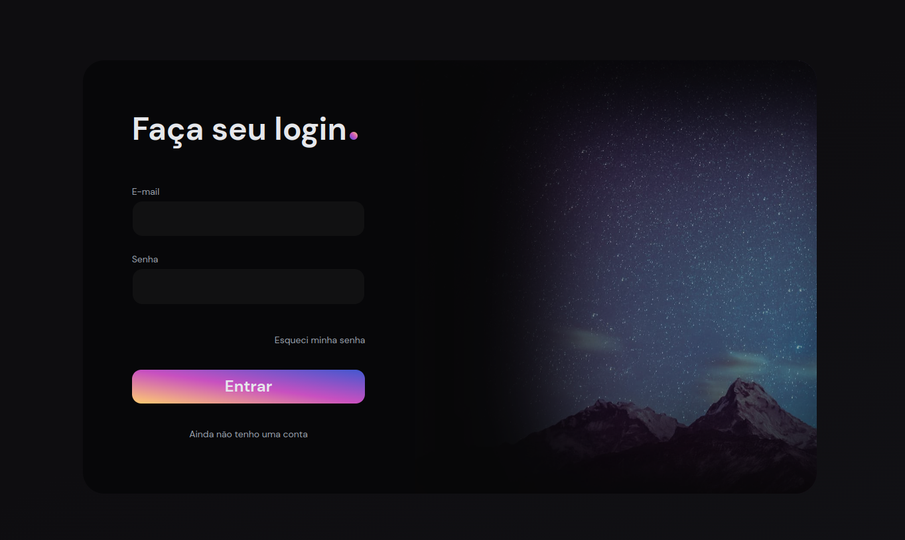

## 💻 Codante.login
> Veja mais em: [a tela de login mais bonita do mundo](https://codante.io/mini-projetos/mp-tela-login-tailwind)

  

## 💻 Projeto

Implementação de uma tela de login bonita usando o framework Tailwind CSS. Proporcionando uma experiência visualmente agradável aos usuários ao fazerem login em seus sistemas.

## 🔨 Features
- Validação formulário
- Responsividade

## 🎲 Base

Este projeto segue o template base (boilerplate) de React + Vite + Tailwind CSS do seguinte repositório: [react.template](https://github.com/jhollyferr/react.template/tree/tailwind)

## 🚀 Tecnologias

Esse projeto foi desenvolvido com as seguintes tecnologias:

- [Node](https://nodejs.org/)
- [ReactJS](https://reactjs.org/)
- [Typescript](https://www.typescriptlang.org/)
- [Tailwind CSS](https://tailwindcss.com/)
- [Vite](https://vitejs.dev/)
- [Vitest](https://vitest.dev/)
- [Yarn](https://yarnpkg.com/)

## Deploy
[Clique aqui](https://codante-login.vercel.app/) para ver a página

## :memo: Licença

Esse projeto está sob a [licença MIT](./LICENSE).

-----

Feito com 💜 por [@jhollyferr](https://instagram.com/jhollyferr) :wave:
